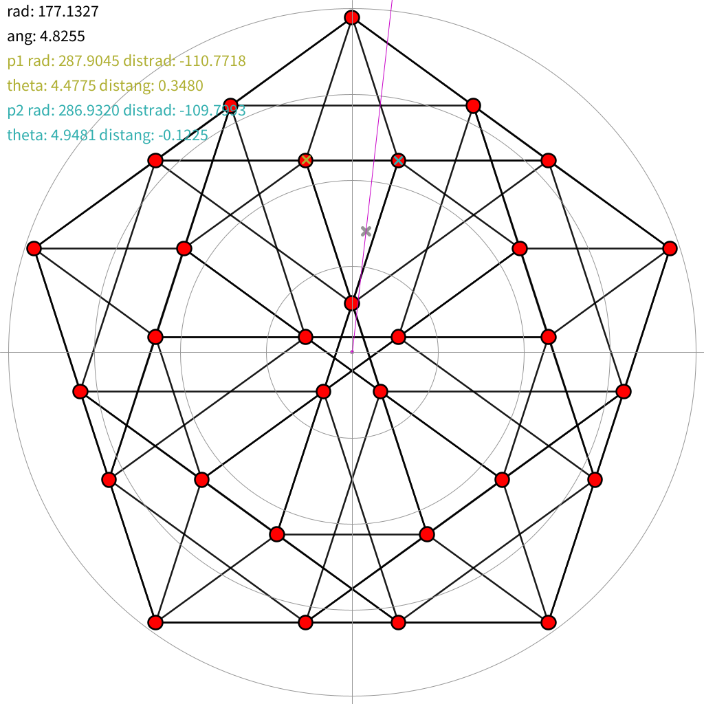

# pjava_meascoord
Utility to measure angles and radii in images

(example using [4-simplex t02.svg from Wikipedia](https://en.wikipedia.org/wiki/File:4-simplex_t02.svg))

The variable "rot" gives the rotation to adjust the image while the variable "fname" gives the file name to be used (in the data folder).

Pressing keys "1" and "2" sets points (underneathing current mouse cursor position) to compare to the mouse cursor point (distrad, distang) and also records their absolute positions.

